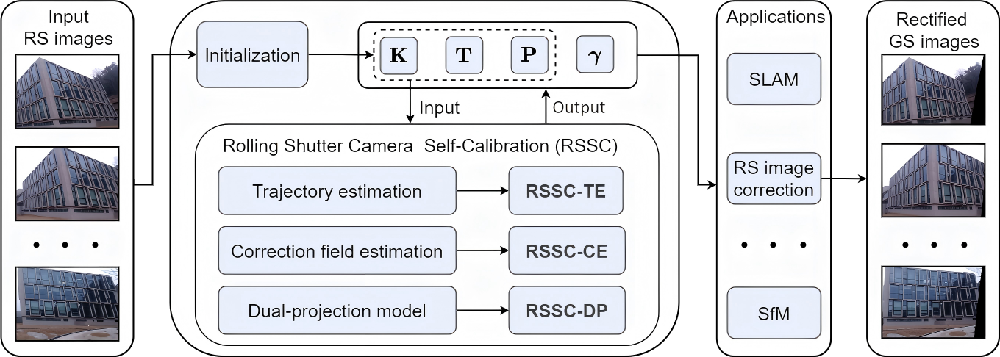

# Rolling Shutter Camera Self-Calibration

Code for **[Rolling Shutter Camera Self-Calibration](https://arxiv.org/pdf/2608.01509)** (ECCV 2026 Oral)

## Abstract
Rolling shutter (RS) cameras are widely used in consumer devices, but their row-wise exposure causes distortions under motion, making geometric 3D vision problems dependent on both camera intrinsics and readout time ratio. Existing RS calibration methods rely on calibration targets or specialised hardware, limiting their use in unconstrained settings. We present the first self-calibration method for RS cameras that directly estimates camera intrinsics and the readout time ratio from image sequences, without requiring calibration targets. The method is implemented as a self-calibrating bundle adjustment (BA), which critically depends on the RS imaging model. We combine two known complementary models. The first formulates RS imaging as continuous-time trajectory estimation under a row-wise pose representation. The second interprets RS images as temporally distorted global shutter (GS) images and requires to estimate correction fields. The combination is non-trivial and results in a unified dual-projection model, in which each 3D point is simultaneously constrained at both row-dependent and reference timestamps along a shared continuous trajectory, enforcing stronger geometric and temporal consistency. Extensive simulations analyse the applicability of several implementations under varying conditions, and real data experiments demonstrate the accuracy, robustness, and practical effectiveness of the proposed approach.

